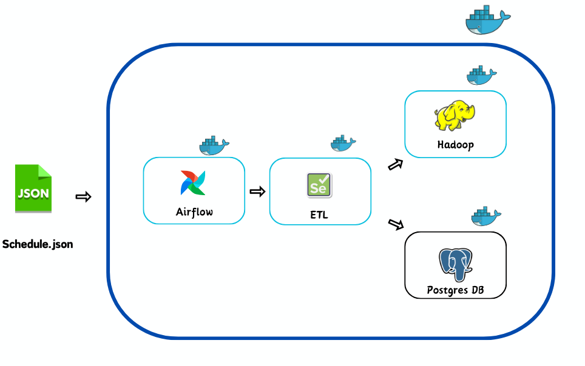
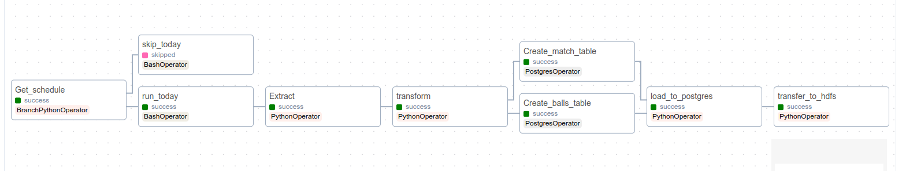

# Automated Webscraping ETL Pipeline with Airflow for Data Collection

## Overview

In Sports Analytics, cricket datasets are mostly paid and offer basic information. To enhance player details for advanced analysis, I've created an ETL pipeline. It collects many useful data from https://www.cricbuzz.com/, storing it in our Postgres database and Hadoop clusters, for a given scheduled series

By giving a Cricket_match_schedule_url we can extract the data of the enitre series

- Special features extracted by this pipeline
   ```bash
   # Ball's Commentry Text
   # Ball's length
   # Ball's line
   # Batsman's shot
   # BAll destination
   # other ball's information
- I created a IPl dataset by using this pipeline check this [IPL_DATASET_2017-2023](https://github.com/Rajadurai2/IPL-Complete_Dataset) 
## Tools
### Automation and ETL Pipeline

- **[Apache Airflow](https://airflow.apache.org/docs/stable/start.html)**

### Database

- **[Postgres](https://www.postgresql.org/)**

## Big data tool

- **[Apache hadoop](https://hadoop.apache.org/)**

### Deployment

- **[Docker](https://www.docker.com/)**

### Programming Language for Webscrapping

- **[Python](https://www.python.org/)**

### Operating System

- **Ubuntu**

## Archietecture 



##  Pipeline




## To Execute this project 


### Installation

1. Install Docker on your machine :

   - **Refer [docker](https://docs.docker.com/get-docker/) site for installation**
2. Clone this Repository
   ```bash
   git clone https://github.com/Rajadurai2/Cricbuzz_ETL_PIpeline_Airflow.git
3. Change to the directory 
   ```bash
   cd Cricbuzz_ETL_PIpeline_Airflow
4. Build our docker image 
   ```bash
   docker build -d airflow_cricbuzz .
5. Run all containers 
   ```bash
   docker-compose up -d
6. Create Schedule.json file 
   ```bash
   docker exec -it cricbuzz_etl_pipeline_airflow_scheduler_1 python get_schedule.py your_series_schedule_url
   # get your_series_schedule_url from https://www.cricbuzz.com/cricket-schedule/series
7. Login to Airflow UI [http://localhost:8080/](http://localhost:8080/)
   ```bash
    # USERNAME : rajabala 
    # PASSWORD : rajabala
8. Unpause our Crickbuzz_ETL DAG

9. Open Pgadmin or Dbeaver to view or data 
   ```bash
   # Database = Crickbuzz
   # Username = rajabala
   # password = rajabala
   # port     = 5433
10. Open hadoop UI to download our csv files [http://localhost:9870/index.html](http://localhost:9870/index.html)

### Containers Running 

- **airflow** 
   - **Scheduler**
   - **Webserver**
- **selenium-chrome**  
- **hadoop :**  
   - **namenode**  
   - **datanode**  
   - **resource-manager**  
   - **nodemanager**  
    - **resourcemanager** 
- **Postgres :** 
   - **airflow_db**
   - **Cricbuzz_db**

## Useful commands
1. To list the running containers
   ```bash
   docker ps
   docker containers ls
2. To update our DAG 
   ```bash
   docker cp dags airflow_scheduler_1:opt/airflow/ 
   # docker cp local_path airflow_scheduler_1:path_inside_container
3. To check logs
   ```bash
   docker logs container_id
4. To run a command inside any container
   ```bash
   docker exec -it container_id your_command

## Note
1. Now this code works for both T20 and ODI series  
2. Need some modification in Extract code for Test series
3. Default time_zone is set for India timezone .Change timezone as need
4. Change Start_date of the DAG as need